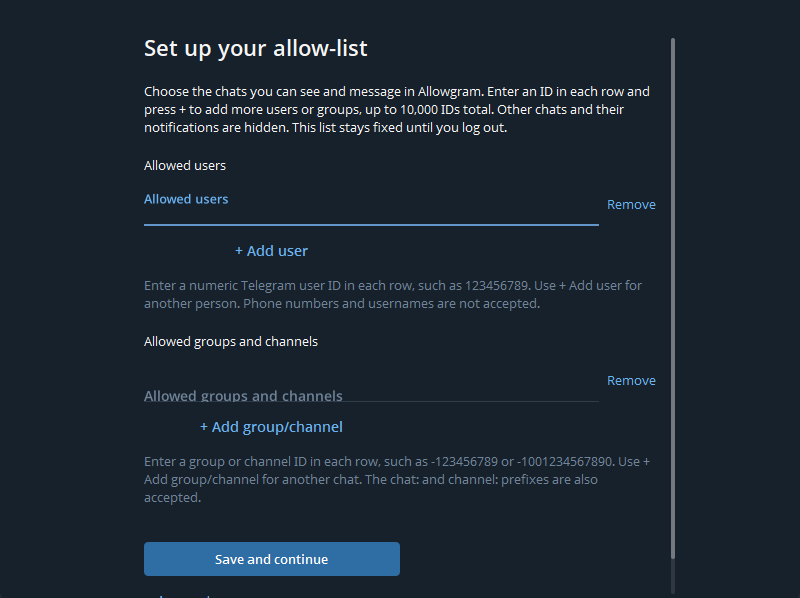

# Allowgram

**A Telegram Desktop-derived Windows client that shows only the conversations you allow.**

Sign in through Telegram's normal phone-number and verification flow, then select the existing chats you want to allow. The setup picker includes archived chats, with optional manual ID entry. Allowgram hides excluded conversations and their notifications and blocks client requests to excluded destinations. Mini Apps can open only for bots explicitly included in the list.

Allowgram is an unofficial, independent modification maintained by [molotovgit](https://github.com/molotovgit). It is not affiliated with or endorsed by Telegram. Telegram Desktop and its contributors remain the authors of the upstream client.

## Start here

- [Installation and package verification](docs/allowgram/installation.md)
- [Set up your allow-list](docs/allowgram/allow-list.md)
- [Use allowed-bot Mini Apps](docs/allowgram/mini-apps.md)
- [Build from source](docs/allowgram/build.md)
- [Frequently asked questions](docs/allowgram/faq.md)

This repository publishes source. **No public installer or GitHub Release is provided by this publication.** Version 7.2.8.4 was built and delivered privately to the owner; a public binary release requires a separate distribution step. Do not substitute an upstream Telegram installer: it does not contain Allowgram's restrictions.

*Legacy manual-ID controls in an isolated documentation fixture; this image does not show the new chat picker. [Follow the illustrated setup guide](docs/allowgram/allow-list.md).*

## What the client enforces

| Capability | Behavior in 7.2.8.7 |
| --- | --- |
| Choose existing chats | Search and check existing conversations after sign-in, then **Save and continue**. Manual IDs remain optional. Up to 10,000 distinct chats total. |
| Conversation visibility | Excluded chat rows, search results, archive entries, message previews, unread badges and notifications are suppressed. |
| Outgoing operations | Supported ordinary text/media require destination and content checks. Emoji, stickers, GIFs, reactions and message effects are disabled. Unknown request types fail closed. |
| Private calls | Incoming and outgoing voice/video calls require an explicitly allowed, known nonbot user. Group membership is not permission. Use the eligible private-chat call button. |
| Restricted navigation | Calls history, new group/channel creation, personal profiles, Saved Messages and additional accounts remain unavailable. |
| Allowed groups | Messages from participants are visible inside an allowed group. This does not allow those participants' DMs or authorize their bots' Mini Apps. |
| Bot Mini Apps | The server-resolved bot must be explicitly allowed. Conversation, reply and send-as contexts are also checked. Links resolve their own target; account switches close app windows. |
| Persistent account policy | The list is stored with the account's encrypted local settings. There is no in-session editor in this version. |

The list is **a client-side restriction**, not a Telegram server rule or device-management policy. Telegram can still receive excluded messages for the account. Other Telegram clients, existing sessions, scheduled server-side actions and someone replacing this application remain outside its control. Read the [security boundaries and disabled features](docs/allowgram/security.md) before relying on it.

## Verification

Version 7.2.8.7 adds [allowed-user private calls](docs/allowgram-7.2.8.7.md) while
retaining earlier hardening. Its package receipt identifies the exact source,
completed synthetic/native checks and remaining live-account acceptance. The
historical counts below describe 7.2.8.4 only.

Version 7.2.8.4 fixes clipped ID fields and aligns Remove with the editable text. It passed **1,284 native UI checks** across four application scales and three window sizes, plus **451 request/message/Mini App checks**, **80 parser checks** and **six schema audits**. The Windows x64 build, isolated startup/install/uninstall, portable startup and package checks also passed. See [testing and evidence](docs/allowgram/testing.md).

The owner reported live success with the earlier 7.2.8.3 release. The 7.2.8.4 checks did not sign in, change an existing list or send live messages; individual dashboard and permission flows are not newly asserted.

## Source and provenance

- [Architecture and boundaries](docs/allowgram/security.md)
- [Changelog](CHANGELOG.md)
- [Original history and atomic commit map](docs/allowgram/history.md)
- [Contribution guidance](CONTRIBUTING.md)
- [Upstream README and third-party notices](README.telegram.md)

The original release history is retained on `archive/release-7.2.8.3`. The initial public `main` reproduced that application tree in smaller commits. Version 7.2.8.4 adds the input-field correction in forward commits; upstream ancestry and attribution remain intact.

## License

GPL-3.0-or-later with the existing OpenSSL linking exception: see [LICENSE](LICENSE) and [LEGAL](LEGAL). Third-party components retain their own licenses. This repository preserves the source layout, copyright notices and pinned submodule references.
