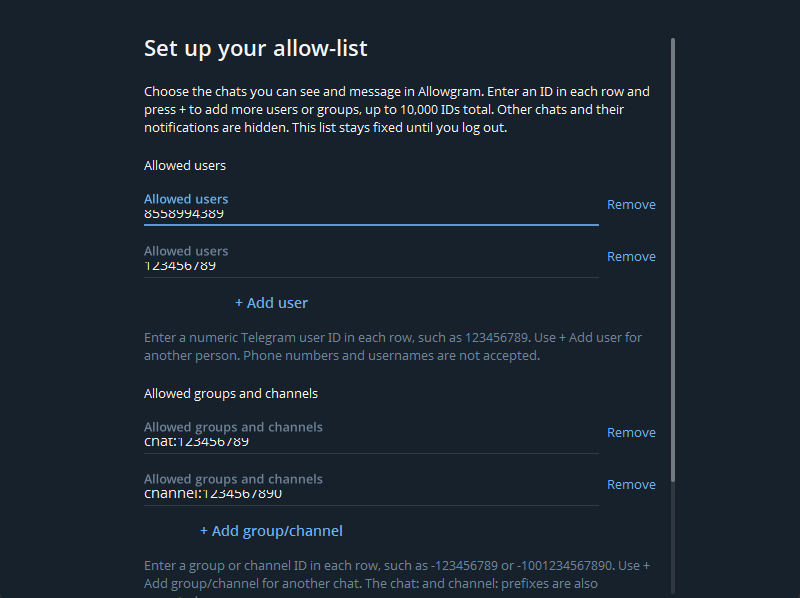
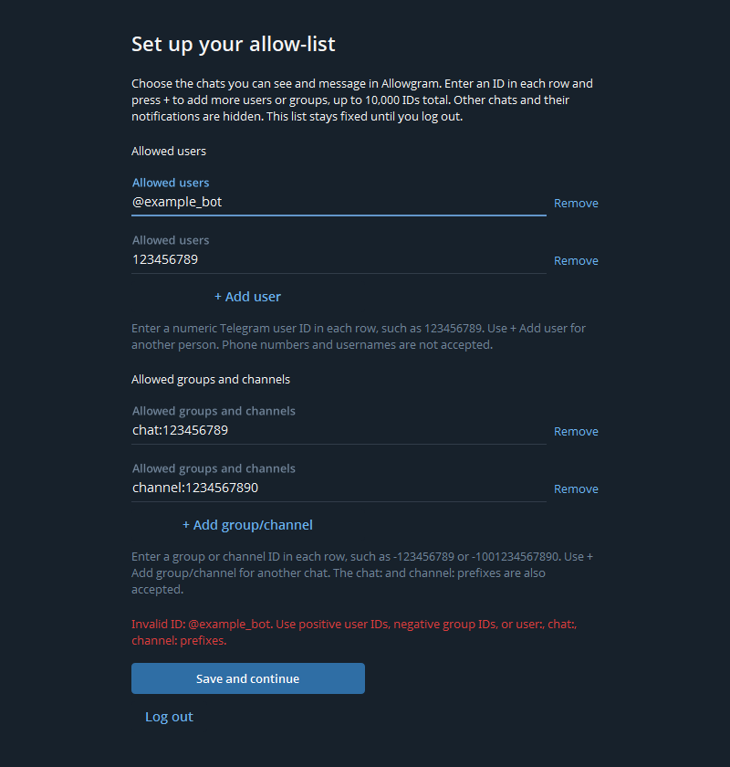

# Set up your allow-list

[Back to Allowgram](../../README.md)

## When setup appears

Complete Telegram's normal phone-number, verification-code and, if enabled, two-step-verification flow. When an account has no saved Allowgram list, **Set up your allow-list** covers the client before conversations become available. Setup requires at least one valid user, bot, group or channel ID. It is not a username search box.

*The real setup controls in an isolated unsigned-in documentation fixture. In ordinary use this screen appears after sign-in. See [capture scope](screenshots.md).*

## Add a user or bot

Version 7.2.8.4 gives each ID row Telegram's native field height and aligns
**Remove** beside the editable text. If your older build clips entered IDs,
install the updated package when available. Use normal scrolling to reach
additional rows, validation messages and **Save and continue**; an arbitrary
number of rows is not expected to fit on one screen.

1. In **Allowed users**, enter the numeric Telegram user ID in the first row.
2. Press **+ Add user** to create another row. Enter one ID per row. Pressing Enter in an ID field also adds a row in that section.
3. Use **Remove** beside an unwanted extra row. The final row in each section stays present and can be left blank.

For example, the public bot **@ClassAAssistant_bot** has ID **8558994389**. Enter `8558994389` under **Allowed users**, exactly as you would a person. Entering its username or its phone number is not supported. Do not infer bot permission merely from membership in an allowed group.

## Add a group or channel

Use **Allowed groups and channels**, then **+ Add group/channel** for each additional chat. Choose the form matching the actual peer type:

| Field | Accepted example | Interpretation |
| --- | --- | --- |
| Allowed users | `123456789` or `user:123456789` | User or bot |
| Allowed groups and channels | `-123456789` or `chat:123456789` | Basic group |
| Allowed groups and channels | `-1001234567890` or `channel:1234567890` | Supergroup or channel |

These are neutral format examples, not a recommended personal list. The bot example above is a public bot identifier. Obtain and verify the IDs for the conversations you actually intend to allow before saving; Allowgram's setup screen does not resolve usernames for you.

The signed channel form is `-(1000000000000 + raw_channel_id)`. Use `channel:` when you have the raw channel ID, so a positive value is not mistaken for a user. IDs are stored with their peer type; matching digits do not make a user and channel the same destination.

*The corrected form shows two user rows and two group/channel rows with fully readable IDs and Save below them. Longer lists use normal scrolling. Copyable format examples are in the table above.*

## Validate and save

Select **Save and continue**. The client validates the combined fields, removes duplicate IDs and permits at most 10,000 distinct entries. Empty extra rows are ignored. Comma, whitespace and semicolon separators are also accepted by the parser, although one ID per row is easier to review.

| Message | What to correct |
| --- | --- |
| “Add at least one user or group ID.” | Both sections are empty. Add a valid entry. |
| “Invalid ID: …” | Use a supported numeric form. Usernames, phone-number notation, zero and malformed values are rejected. |
| “ID … is in the wrong field.” | Move users/bots to Allowed users and groups/channels to the group section. |
| “The allow-list can contain up to 10,000 IDs.” | Remove entries to stay within the total limit. |
| “The allow-list input is too long.” | Shorten oversized input; the parser bounds total input bytes. |
| “The allow-list could not be saved. Check free disk space and try again.” | Correct the local storage problem and retry. The client remains locked if saving fails. |

*The real parser rejects `@example_bot`; its complete error and Save button are visible here. Correct the entry and try again, scrolling if needed. This fixture demonstrates validation only; it does not save a policy to a signed-in account.*

After a successful save, the setup lock closes and only permitted conversations become available. Saving an ID does not join a private group, create membership or override Telegram's posting permissions. A permitted chat may still need to be opened or loaded through Telegram before it appears.

## Plan the list before saving

- Include your own Telegram user ID if you need **Saved Messages**.
- Include the linked discussion group's ID if you need channel comments.
- An allowed group shows its participants' messages; add a participant separately only if you also want their DM.
- A basic group migrating to a supergroup receives a different peer ID.
- For Mini Apps, include the owning bot under **Allowed users** as well as any associated launching conversation.

## Later changes

**Version 7.2.8.4 has no in-session allow-list editor.** The list survives restarts in encrypted local account settings and remains fixed until logout. Logging out clears that local account data; the next sign-in requires setup again. Do not log out just to view this guide or enable an app for a bot already on your saved list. Adding a new bot later requires planning a deliberate reconfiguration and being able to authenticate again.

See [Mini Apps](mini-apps.md), [FAQ](faq.md) and [client-side boundaries](security.md).
