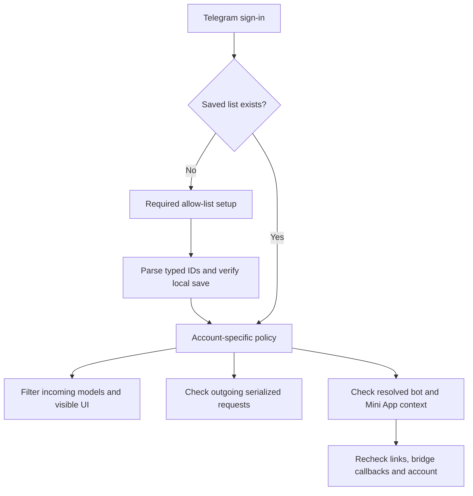

# Architecture and security boundaries

[Back to Allowgram](../../README.md)

Allowgram enforces an account-specific policy inside this client. It is not a Telegram server policy, a tamper-resistant parental-control system or device-management software. Another unrestricted Telegram client can show the account's other messages. A person with control of the computer can replace the program or delete its local account data. Telegram can still receive excluded messages, and previously scheduled server-side actions remain outside the client's control.

## Policy flow

Version 7.2.8.5 adds a shared profile-presentation gate, a new-login model guard,
explicit self-chat exclusion and outgoing content classification. Client sends
require safe final text/entities and inspectable media. Uploaded file prefixes
and cached document/message metadata feed a session-owned transport context;
callers without that context cannot authorize opaque media or forwards.
URL previews and message effects are suppressed. See [scope and conservative
restrictions](../allowgram-7.2.8.5.md); no server-wide or live-account guarantee
is implied by these source changes.

| Layer | Relevant source | Responsibility |
| --- | --- | --- |
| Input policy | `main/allowlist_policy.*` | Typed IDs, duplicates, input size and entry limits. |
| Setup and persistence | `window/window_allowlist.*`, `main/main_session*`, `storage/storage_account.*` | Required setup, encrypted account settings and verified save before unlocking. |
| Incoming data and UI | `mtproto/allowlist_message_guard.h`, data/dialogs/notifications/navigation code | Discard excluded messages and suppress excluded rows, previews, unread counts and navigation. |
| Transport | `mtproto/allowlist_request_guard.*` and request inventories | Inspect generated serialized Telegram requests; reject unknown or unsupported methods. |
| Mini Apps | `inline_bots/bot_attach_web_view.*`, `ui/chat/attach/attach_bot_webview.*` | Bind the server-resolved bot to allowed context, retain native web security and consent, recheck reuse and delayed actions. |

Source paths above are relative to `Telegram/SourceFiles/`.

Mini App requests require both an allowed typed user ID and a loaded server-resolved bot identity. Conversation, reply-to, from-message access and send-as peers are checked where applicable. Named app lookup and launch preserve the bot identity; opaque or mismatched app owners fail closed. In-app Telegram links must resolve independently. Active-account changes close app windows, and expired conversation contexts cannot authorize delayed actions.

## Intentional limitations

- An allowed group includes its participants' messages. A participant need not be individually allowed for their message to appear inside that group; their DM and bot-app permission are separate.
- Calls, aggregate stories/discovery, broad story publishing, automated business messaging and unscoped communication features are disabled.
- Raw exports, takeout sessions and arbitrary URL previews/instant views are disabled.
- Some Mini App bridge functions are disabled; see [Mini Apps](mini-apps.md).
- Third-party web content and its backend roles remain governed by that service. Opening a bot app is not an administrator grant.
- Existing account encryption and Telegram transport behavior are inherited. No independent cryptographic or penetration audit is claimed.

## Reporting a concern

Never put tokens, phone numbers, login codes, session files, full desktop screenshots or personal allow-lists into a public issue. A safe report can describe the route, peer type, expected restriction, observed behavior and version using neutral examples. For an exploitable issue, coordinate a private reporting channel with the maintainer before sharing sensitive reproduction material. This repository does not promise a monitored security mailbox or response SLA.
